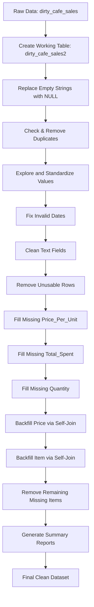

#  Dirty Cafe Sales – Data Cleaning Script

This project contains a **SQL-based data cleaning pipeline** for the `dirty_cafe_sales` dataset.  
It standardizes, cleans, and prepares the data for analysis, following well-defined and documented steps.

---

##  Overview

The script:
1. Creates a working copy of the raw data (`dirty_cafe_sales2`)
2. Handles missing or invalid values
3. Removes duplicates
4. Standardizes formats (dates, text fields, categories)
5. Calculates missing numeric fields
6. Backfills missing values using self-joins
7. Removes unusable rows
8. Produces final cleaned data and summary reports

---

##  How to Use

1. **Import the SQL script** into your MySQL environment.
2. **Run all steps in sequence** – the script is already ordered from raw data load to final output.
3. Review the **final cleaned table**:  
   ```sql
   SELECT * FROM dirty_cafe_sales2;
